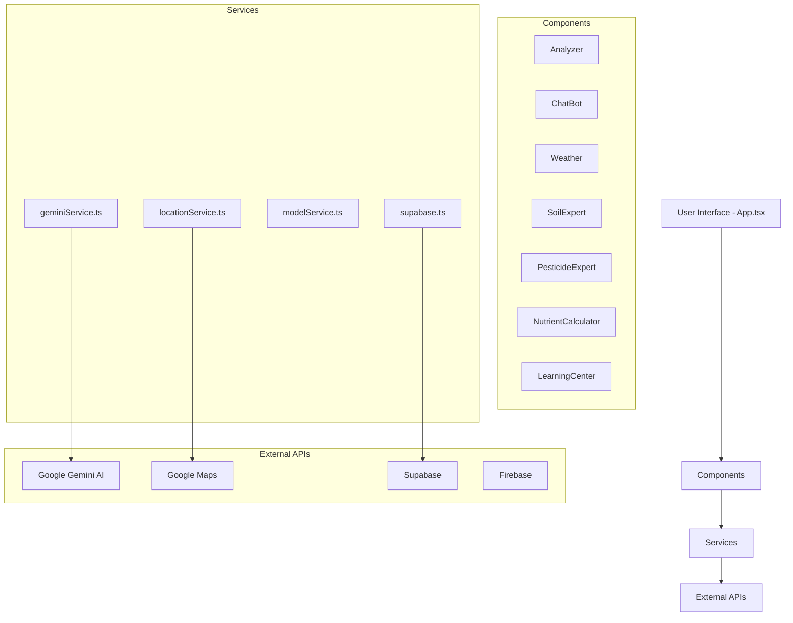
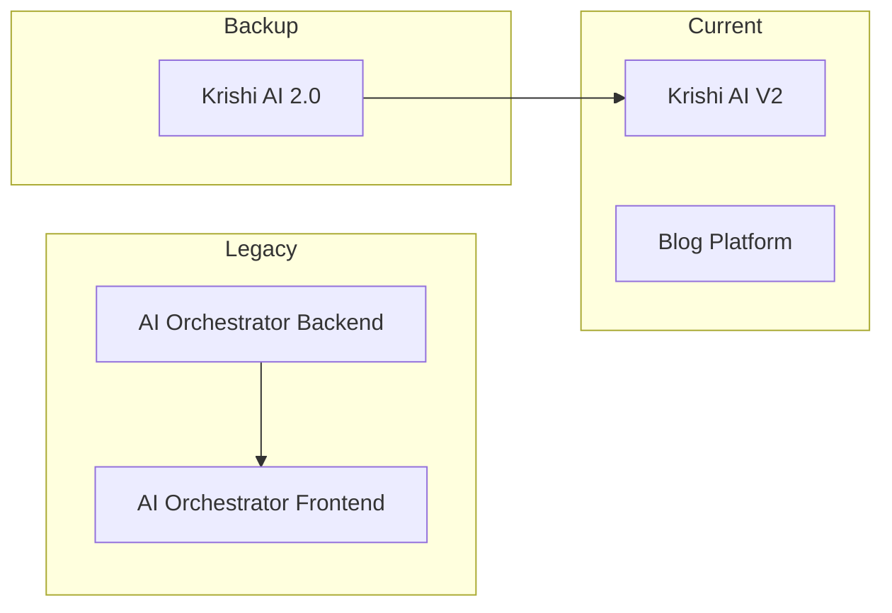

# Krishi AI - Complete Function Documentation

## Project Overview

Krishi AI is a comprehensive agricultural AI ecosystem for Bangladeshi farmers, built with React, TypeScript, and Vite. It provides expert diagnosis, weather forecasting, nutrient calculation, and agricultural guidance using Google Gemini AI.

---

## 1. Main Application - [`App.tsx`](../App.tsx)

### Core Functions

| Function | Description | Parameters | Returns |
|----------|-------------|------------|---------|
| `App` | Main application component managing navigation, user state, and speech context | None | JSX.Element |
| `useSpeech` | Custom hook to access speech context | None | SpeechContextType |
| `stopSpeech` | Stops current audio playback | None | void |
| `playSpeech` | Plays text-to-speech audio | text: string, audioBase64?: string | Promise<void> |
| `setIsPlayingState` | Updates speaking state | val: boolean | void |
| `handleNavigate` | Navigation handler for view changes | view: View | void |
| `handleAction` | Awards XP points to user | xp: number | void |
| `handleSaveReport` | Saves analysis report to history | report: Omit<SavedReport, "id" | "timestamp"> | void |
| `renderView` | Renders current view based on state | None | JSX.Element |

### Helper Components

- `DrawerSection` - Drawer menu section wrapper
- `DrawerItem` - Individual drawer menu item
- `NavButton` - Bottom navigation button

---

## 2. Components

### 2.1 Analyzer - [`components/Analyzer.tsx`](../components/Analyzer.tsx)

| Function | Description |
|----------|-------------|
| `Analyzer` | Main AI scanner component for crop disease/pest/nutrient diagnosis |
| `startLiveMode` | Activates live camera for real-time scanning |
| `stopLiveMode` | Deactivates live camera mode |
| `captureFrame` | Captures frame from video for analysis |
| `handleAnalyze` | Performs AI analysis on captured/uploaded image |
| `handlePrecisionSubmit` | Submits precision form data for deep audit |
| `handleSaveToHistory` | Saves analysis report with audio to history |

### 2.2 ChatBot - [`components/ChatBot.tsx`](../components/ChatBot.tsx)

| Function | Description |
|----------|-------------|
| `ChatBot` | AI chat assistant for agricultural queries |
| `fetchWeatherWithLocation` | Fetches weather data based on user location |
| `handleSend` | Sends user message and gets AI response |
| `playMessageAudio` | Plays audio response for a message |
| `toggleListening` | Toggles voice input recognition |

### 2.3 Weather - [`components/Weather.tsx`](../components/Weather.tsx)

| Function | Description |
|----------|-------------|
| `Weather` | Weather display component with forecast and risks |
| `toBanglaNumber` | Converts numbers to Bengali numerals |
| `loadInitialWeather` | Loads cached or fresh weather data |
| `fetchWeather` | Fetches current weather from API |
| `playWeatherAudio` | Plays weather summary audio |

### 2.4 SoilExpert - [`components/SoilExpert.tsx`](../components/SoilExpert.tsx)

| Function | Description |
|----------|-------------|
| `SoilExpert` | Soil health analysis and management tool |
| `handleDetectAEZ` | Detects Agro-Ecological Zone from location |
| `handleAuditSubmit` | Submits soil data for health audit |
| `toggleListening` | Toggles voice input for form fields |
| `calculateOrganicMatter` | Calculates organic matter requirements |

### 2.5 PesticideExpert - [`components/PesticideExpert.tsx`](../components/PesticideExpert.tsx)

| Function | Description |
|----------|-------------|
| `PesticideExpert` | Pesticide advisory and mixing analysis tool |
| `handleSearchSubmit` | Searches for pesticide information |
| `handleMixingAnalysis` | Analyzes chemical mixing compatibility |
| `handleRotationAdvice` | Gets resistance management advice |
| `getSprayAdvisory` | Generates spray timing advisory |

### 2.6 NutrientCalculator - [`components/NutrientCalculator.tsx`](../components/NutrientCalculator.tsx)

| Function | Description |
|----------|-------------|
| `NutrientCalculator` | Fertilizer requirement calculator |
| `handleDetectAEZ` | Auto-detects AEZ for location-based recommendations |
| `calculateNutrientsAI` | Gets AI-powered nutrient recommendations |
| `toggleListening` | Voice input for form fields |
| `handleSaveReport` | Saves nutrient report to history |

### 2.7 LearningCenter - [`components/LearningCenter.tsx`](../components/LearningCenter.tsx)

| Function | Description |
|----------|-------------|
| `LearningCenter` | Educational hub with multiple learning modes |
| `PlantScanner` | Plant identification sub-component |
| `QuizModule` | Agricultural quiz sub-component |
| `Encyclopedia` | Agricultural encyclopedia search |

### 2.8 Other Components

| Component | File | Description |
|-----------|------|-------------|
| `AIYieldPredictor` | [`AIYieldPredictor.tsx`](../components/AIYieldPredictor.tsx) | AI-powered crop yield prediction |
| `BiocontrolGuide` | [`BiocontrolGuide.tsx`](../components/BiocontrolGuide.tsx) | Biological pest control guide |
| `CropCalendar` | [`CropCalendar.tsx`](../components/CropCalendar.tsx) | Crop scheduling calendar |
| `CropDiseaseLibrary` | [`CropDiseaseLibrary.tsx`](../components/CropDiseaseLibrary.tsx) | Disease/pest reference library |
| `FAQ` | [`FAQ.tsx`](../components/FAQ.tsx) | Frequently asked questions |
| `FieldMap` | [`FieldMap.tsx`](../components/FieldMap.tsx) | Field mapping with Google Maps |
| `FieldMonitoring` | [`FieldMonitoring.tsx`](../components/FieldMonitoring.tsx) | Satellite field monitoring |
| `LeafColorChart` | [`LeafColorChart.tsx`](../components/LeafColorChart.tsx) | LCC-based nitrogen management |
| `QRGenerator` | [`QRGenerator.tsx`](../components/QRGenerator.tsx) | QR code generation for sharing |
| `SearchTool` | [`SearchTool.tsx`](../components/SearchTool.tsx) | Agricultural information search |
| `ShareDialog` | [`ShareDialog.tsx`](../components/ShareDialog.tsx) | Share and install prompt dialog |
| `TaskScheduler` | [`TaskScheduler.tsx`](../components/TaskScheduler.tsx) | Farm task scheduling |
| `UserProfile` | [`UserProfile.tsx`](../components/UserProfile.tsx) | User profile management |
| `YieldCalculator` | [`YieldCalculator.tsx`](../components/YieldCalculator.tsx) | Manual yield calculation |
| `AgriPodcast` | [`AgriPodcast.tsx`](../components/AgriPodcast.tsx) | Agricultural podcast player |
| `CABIDiagnosisTraining` | [`CABIDiagnosisTraining.tsx`](../components/CABIDiagnosisTraining.tsx) | CABI diagnosis training module |

---

## 3. Services

### 3.1 Gemini Service - [`services/geminiService.ts`](../services/geminiService.ts)

| Function | Description | Parameters | Returns |
|----------|-------------|------------|---------|
| `extractJSON` | Extracts JSON from text response | text: string, defaultValue: T | T |
| `withRetry` | Retry wrapper for API calls | fn: Promise<T>, maxRetries: number | Promise<T> |
| `decodeBase64` | Decodes base64 to Uint8Array | base64: string | Uint8Array |
| `decodeAudioData` | Decodes audio data for playback | data, ctx, sampleRate, numChannels | Promise<AudioBuffer> |
| `analyzeCropImage` | Analyzes crop image for diagnosis | base64Data, mimeType, options | Promise<AnalysisResult> |
| `generateAgriImage` | Generates agricultural images | prompt: string | Promise<string> |
| `generateSpeech` | Text-to-speech generation | text: string | Promise<string> |
| `getLiveWeather` | Gets live weather data | lat, lng, force, lang | Promise<WeatherData> |
| `sendChatMessage` | Sends chat message to AI | history, message, persona, role, weather, crops | Promise<{text, groundingChunks}> |
| `searchAgriculturalInfo` | Searches agricultural information | query: string | Promise<{text, groundingChunks}> |
| `getAIPlantNutrientAdvice` | Gets nutrient recommendations | crop, aez, soil, areaSize, unit, lang | Promise<string> |
| `getBiocontrolExpertAdvice` | Gets biocontrol advice | query: string | Promise<string> |
| `interpretSoilReportAI` | Interprets soil lab report | inputs: any | Promise<string> |
| `getPesticideExpertAdvice` | Gets pesticide advice | query, lang | Promise<{text, groundingChunks}> |
| `analyzePesticideMixing` | Analyzes mixing compatibility | items, weather, lang | Promise<{text, groundingChunks}> |
| `getPesticideRotationAdvice` | Gets rotation advice | query, lang | Promise<{text, groundingChunks}> |
| `requestPesticidePrecisionParameters` | Gets precision form fields | query, lang | Promise<any[]> |
| `performDeepPesticideAudit` | Performs deep pesticide audit | query, dynamicData, lang | Promise<{text, groundingChunks}> |
| `getAISprayAdvisory` | Gets spray timing advisory | crop, pest, weather, lang | Promise<{text, groundingChunks}> |
| `performSoilHealthAudit` | Performs soil health audit | inputs, aez, lang | Promise<string> |
| `requestSoilPrecisionParameters` | Gets soil precision fields | inputs, aezName, lang | Promise<any[]> |
| `performDeepSoilAudit` | Performs deep soil audit | inputs, aezName, dynamicData, lang | Promise<string> |
| `getCropDiseaseInfo` | Gets crop disease information | crop: string | Promise<{data: CropDiseaseReport}> |
| `getFieldMonitoringData` | Gets field monitoring data | lat, lng, aezName | Promise<{text, groundingChunks}> |
| `getLCCAnalysisSummary` | Gets LCC analysis | lcc, tsr, dose, lang | Promise<string> |
| `identifyPlantSpecimen` | Identifies plant from image | base64, mimeType, lang | Promise<{text, groundingChunks}> |
| `searchNearbySellers` | Searches nearby agricultural sellers | lat, lng, type, lang | Promise<{text, groundingChunks}> |
| `getAgriFlashCards` | Generates flashcards | topic: string | Promise<FlashCard[]> |
| `getAICropSchedule` | Gets crop schedule | crop, today, season | Promise<any[]> |
| `getAgriMetaExplanation` | Gets meta explanations | query: string | Promise<string> |
| `generateAgriQuiz` | Generates quiz questions | topic, lang | Promise<AgriQuizQuestion[]> |
| `searchEncyclopedia` | Searches encyclopedia | query, lang | Promise<{text, groundingChunks}> |

### 3.2 Location Service - [`services/locationService.ts`](../services/locationService.ts)

| Function | Description | Parameters | Returns |
|----------|-------------|------------|---------|
| `saveStoredLocation` | Saves location to localStorage | lat, lng | void |
| `getStoredLocation` | Retrieves stored location | None | StoredLocation \| null |
| `clearStoredLocation` | Clears stored location | None | void |
| `getNearestAEZ` | Finds nearest AEZ zone | lat, lng | AEZInfo |
| `detectCurrentAEZDetails` | Detects AEZ from geolocation | force: boolean | Promise<AEZInfo> |

### 3.3 Other Services

| Service | File | Description |
|---------|------|-------------|
| `firebase.ts` | [`services/firebase.ts`](../services/firebase.ts) | Firebase initialization and auth |
| `supabase.ts` | [`services/supabase.ts`](../services/supabase.ts) | Supabase client and data sync |
| `shareService.ts` | [`services/shareService.ts`](../services/shareService.ts) | Sharing functionality |
| `modelService.ts` | [`services/modelService.ts`](../services/modelService.ts) | AI model management and routing |
| `huggingfaceService.ts` | [`services/huggingfaceService.ts`](../services/huggingfaceService.ts) | HuggingFace model integration |

---

## 4. Types - [`types.ts`](../types.ts)

### Enums

- `View` - Application view states (HOME, TOOLS, CHAT, ANALYZER, etc.)

### Interfaces

| Interface | Description |
|-----------|-------------|
| `User` | User profile data structure |
| `UserProgress` | Gamification progress data |
| `UserCrop` | User's crop information |
| `SavedReport` | Saved analysis report |
| `AnalysisResult` | AI analysis result |
| `WeatherData` | Weather information |
| `ChatMessage` | Chat message structure |
| `GroundingChunk` | Google Search grounding data |
| `FlashCard` | Learning flashcard |
| `AgriTask` | Scheduled task |
| `CropDiseaseReport` | Disease/pest report |
| `AgriQuizQuestion` | Quiz question structure |

---

## 5. Constants - [`constants.ts`](../constants.ts)

| Constant | Description |
|----------|-------------|
| `CROP_CATEGORIES` | Crop category definitions with icons |
| `CROPS_BY_CATEGORY` | Crop names organized by category |
| `AGRI_SEASONS` | Agricultural season definitions |
| `COMMODITIES_DATA` | Market commodity prices |
| `DISTRICT_UPAZILA_MAP` | Bangladesh district/upazila mapping |

---

## 6. Configuration Files

### [`vercel.json`](../vercel.json)

- Build command: `npm run build`
- Output directory: `dist`
- Framework: Vite
- SPA routing with rewrites
- Security headers configured

### [`vite.config.ts`](../vite.config.ts)

- React plugin enabled
- Environment variable mapping
- Code splitting for vendor and Firebase
- Development server on port 3000

### [`package.json`](../package.json)

Key dependencies:

- React 19.2.3
- Google GenAI SDK
- Firebase
- Supabase
- Recharts for charts

---

## 7. Data Flow Diagram

---

## 8. Key Features Summary

1. **AI Crop Scanner** - Image-based pest/disease/nutrient diagnosis
2. **Chat Assistant** - Conversational agricultural guidance
3. **Weather Dashboard** - Location-based weather with agricultural insights
4. **Soil Expert** - Soil health analysis and recommendations
5. **Pesticide Expert** - Pesticide advisory and mixing analysis
6. **Nutrient Calculator** - Fertilizer requirement calculation
7. **Learning Center** - Educational content, quizzes, plant identification
8. **Field Monitoring** - Satellite-based field monitoring
9. **Crop Calendar** - Seasonal crop scheduling
10. **Task Scheduler** - Farm task management
11. **Market Prices** - Commodity price tracking
12. **Yield Prediction** - AI-powered yield forecasting

---

---

## 9. Project Backup Analysis

The `project_backup` directory contains several additional projects and earlier versions:

### 9.1 AI Orchestrator Backend - [`project_backup/backend/`](../project_backup/backend/)

A Node.js Express backend for multi-model AI orchestration.

| Endpoint | Method | Description |
|----------|--------|-------------|
| `/api/chat` | POST | Main AI chat endpoint supporting multiple models |
| `/api/health` | GET | Health check endpoint |

**Supported AI Models:**

- **Gemini** - Google's Gemini Pro and Gemini Pro Vision
- **ChatGPT** - OpenAI's GPT-3.5-turbo
- **Hugging Face** - Flan-T5-small model

**Key Features:**

- Image upload support via multer
- Base64 image encoding for vision models
- CORS configuration for cross-origin requests
- Error handling with retry logic

### 9.2 Blog Platform - [`project_backup/blog.krishiai.live/`](../project_backup/blog.krishiai.live/)

A Next.js 16 blog application for Krishi AI content.

| File | Description |
|------|-------------|
| [`lib/posts.js`](../project_backup/blog.krishiai.live/lib/posts.js) | Blog post management |
| [`lib/supabaseClient.js`](../project_backup/blog.krishiai.live/lib/supabaseClient.js) | Supabase client |
| [`supabase_schema.sql`](../project_backup/blog.krishiai.live/supabase_schema.sql) | Database schema |
| [`components/Navbar.js`](../project_backup/blog.krishiai.live/components/Navbar.js) | Navigation component |
| [`components/Footer.js`](../project_backup/blog.krishiai.live/components/Footer.js) | Footer component |

**Tech Stack:**

- Next.js 16.1.1
- React 19.2.3
- Supabase for backend
- Tailwind CSS 4
- Markdown rendering with remark

### 9.3 AI Orchestrator Frontend - [`project_backup/frontend/`](../project_backup/frontend/)

A React 18 frontend for the AI orchestrator backend.

| File | Description |
|------|-------------|
| [`src/App.js`](../project_backup/frontend/src/App.js) | Main application component |
| [`src/App.css`](../project_backup/frontend/src/App.css) | Application styles |

**Tech Stack:**

- React 18.2.0
- Axios for API calls
- React Scripts 5.0.1

### 9.4 Krishi AI 2.0 - [`project_backup/krishi-ai-2.0/`](../project_backup/krishi-ai-2.0/)

An earlier version of the main Krishi AI project with extended features.

**Additional Functions in Backup geminiService.ts:**

| Function | Description |
|----------|-------------|
| `getApiKey` | Retrieves Gemini API key from environment |
| `getBackendUrl` | Retrieves backend URL from environment |

**Additional Types:**

- `CABITrainingModule` - CABI training module structure
- `DiagnosisResult` - Extended diagnosis result
- `CABIScenario` - CABI diagnosis scenario

### 9.5 Execution Scripts - [`project_backup/execution/`](../project_backup/execution/)

Python utility scripts for development.

| Script | Description |
|--------|-------------|
| [`list_models.py`](../project_backup/execution/list_models.py) | Lists available AI models |
| [`list_models_v2.py`](../project_backup/execution/list_models_v2.py) | Updated model listing script |
| [`supabase_query.py`](../project_backup/execution/supabase_query.py) | Supabase database queries |

### 9.6 My Genkit Project - [`project_backup/my-genkit-project/`](../project_backup/my-genkit-project/)

A Firebase Genkit project for AI function generation.

---

## 10. Architecture Evolution

---

## 11. Summary of Backup Contents

| Project | Technology | Purpose |
|---------|------------|---------|
| backend | Node.js/Express | Multi-model AI orchestration |
| frontend | React 18 | AI orchestrator UI |
| blog.krishiai.live | Next.js 16 | Content/blog platform |
| krishi-ai-2.0 | React/Vite | Earlier version of main app |
| my-genkit-project | Firebase Genkit | AI function generation |
| execution | Python | Development utilities |

---

*Documentation generated on February 22, 2026*
*Updated with project_backup analysis*
