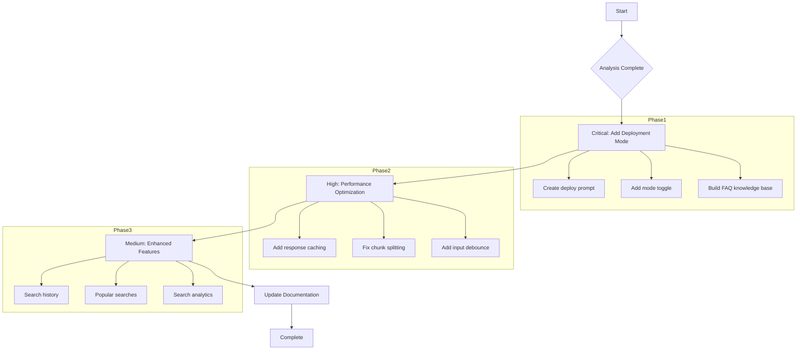

# Krishi AI Search Infrastructure Gap Analysis

**Date:** March 2, 2026  
**Status:** Analysis Complete  
**Version:** 1.0

---

## Executive Summary

This document provides a comprehensive analysis of the Krishi AI search infrastructure, identifying gaps between current capabilities and deployment troubleshooting requirements. The analysis reveals several critical areas for improvement, particularly around deployment-specific queries and performance optimization.

---

## 1. Current Search Capabilities

### 1.1 SearchTool Component (`components/SearchTool.tsx`)

| Feature | Status | Implementation |
|---------|--------|----------------|
| Market Mode (Local Data) | ✅ Active | Static `COMMODITIES_DATA` from `constants.ts` |
| AI Mode (Gemini + Search) | ✅ Active | Uses `searchAgriculturalInfo()` function |
| Voice Input (bn-BD) | ✅ Active | Web Speech API with Bangla locale |
| Text-to-Speech | ✅ Active | Backend TTS service integration |
| District Filtering | ✅ Active | 8 major districts |
| Category Filtering | ✅ Active | 7 categories (সবজি, শস্য, মসলা, etc.) |

### 1.2 Search Functions in geminiService

| Function | Purpose | Grounding |
|----------|---------|-----------|
| `searchAgriculturalInfo()` | General agri queries | Google Search |
| `analyzeCropImage()` | Plant disease/pest detection | BARI/BRRI/DAE sources |
| `sendChatMessage()` | Chatbot interactions | Government repositories |
| `getLiveWeather()` | Weather data | Google Search |
| `getPesticideExpertAdvice()` | Pesticide queries | DAE sources |

### 1.3 Performance Configuration

**Vite Config (`vite.config.ts`):**
- Vendor chunking: React, Firebase separated
- Minification: esbuild enabled
- Sourcemap: Disabled for production
- Asset hashing: Enabled

**Vercel Headers (`vercel.json`):**
- Static assets: 1-year cache (immutable)
- HTML: No cache (must-revalidate)
- Security headers: X-Content-Type-Options, X-Frame-Options, X-XSS-Protection

---

## 2. Gap Analysis

### 2.1 Deployment Troubleshooting Query Capability

**CRITICAL GAP:** The current search infrastructure has **NO capability** to handle deployment-specific queries.

| Query Type | Current Support | Required for Deployment |
|------------|-----------------|-------------------------|
| "Build failed with error X" | ❌ None | Critical |
| "Vercel deployment stuck" | ❌ None | Critical |
| "API key not found" | ❌ None | Critical |
| "CORS error on API call" | ❌ None | High |
| "Environment variable missing" | ❌ None | Critical |
| "Bundle size too large" | ❌ None | High |
| "Caching not working" | ❌ None | Medium |
| "404 on static assets" | ❌ None | High |

**Root Cause:** All search functions are agricultural-domain specific with hardcoded prompts like:
```typescript
"Answer the following agri query using Bangladesh government official data: ${query}"
```

### 2.2 Performance Bottlenecks

| Issue | Severity | Location | Impact |
|-------|----------|----------|--------|
| No query result caching | High | `geminiService.ts` | Repeated API calls for same queries |
| No request deduplication | Medium | `SearchTool.tsx` | Multiple rapid clicks cause queue buildup |
| Large vendor bundle | Medium | `vite.config.ts` | 2 chunks (vendor, firebase) insufficient |
| No search indexing | Medium | Market mode | O(n) filter on 12 commodities |
| AudioContext recreation | Low | `SearchTool.tsx` | Minor memory leak potential |

#### Detailed Bottleneck Analysis

**1. Missing Response Caching:**
```typescript
// Current: Every call hits API
export const searchAgriculturalInfo = async (query: string) => {
  const response = await generateContentWithFallback({...});
  return {...};  // No caching layer
};
```
**Impact:** Same agricultural query repeated → full API cost + latency every time

**2. Insufficient Chunk Splitting:**
```typescript
// Current vite.config.ts
manualChunks: {
  vendor: ['react', 'react-dom'],
  firebase: ['firebase/app', 'firebase/auth'],
  services: ['./services/geminiService', ...],  // Path doesn't work!
}
```
**Issue:** The `services` path in manualChunks is incorrect - should be package names, not paths.

**3. No Debouncing on Search Input:**
```typescript
// SearchTool.tsx line 248
onChange={(e) => setQuery(e.target.value)}  // No debounce
```
**Impact:** Every keystroke triggers re-render of filtered items

### 2.3 Missing Search Features for Production

| Feature | Status | Priority |
|---------|--------|----------|
| Search history/persistence | ❌ Missing | High |
| Popular/recent searches | ❌ Missing | Medium |
| Search analytics | ❌ Missing | Medium |
| Offline search fallback | ❌ Missing | Low |
| Multi-language query support | ⚠️ Partial | High |
| Deployment troubleshooting mode | ❌ Missing | Critical |

---

## 3. Recommendations

### 3.1 Critical: Add Deployment Troubleshooting Mode

**Rationale:** Users need to troubleshoot deployment issues without leaving the app or consulting external documentation.

**Implementation Plan:**

1. **Create deploymentSearchSystem prompt:**
```typescript
const DEPLOYMENT_SYSTEM_PROMPT = `You are a DevOps expert specializing in Vercel, React, and Firebase deployments.
Available domains:
- Build errors (npm, TypeScript, Vite)
- Vercel deployment issues
- Environment configuration
- Performance optimization
- API troubleshooting

When user asks about deployment:
1. Identify the error type
2. Provide specific fix steps
3. Reference relevant documentation if available`;
```

2. **Add mode toggle in SearchTool:**
```typescript
const SEARCH_MODES = ['market', 'ai', 'deploy'] as const;
type SearchMode = typeof SEARCH_MODES[number];
```

3. **Create deployment FAQ knowledge base:**
```typescript
const DEPLOYMENT_FAQS = [
  {
    keywords: ['build', 'failed', 'error'],
    solutions: [
      'Run `npm run build` locally to see full error',
      'Check TypeScript errors: `npx tsc --noEmit`',
      'Verify all dependencies in package.json are valid'
    ]
  },
  // ... more FAQs
];
```

### 3.2 High Priority: Performance Optimization

**1. Add Response Caching Layer:**
```typescript
// services/searchCache.ts
const queryCache = new Map<string, { data: any, timestamp: number }>();
const CACHE_TTL = 15 * 60 * 1000; // 15 minutes

export const cachedSearch = async (query: string, searchFn: () => Promise<any>) => {
  const cached = queryCache.get(query);
  if (cached && Date.now() - cached.timestamp < CACHE_TTL) {
    return cached.data;
  }
  const result = await searchFn();
  queryCache.set(query, { data: result, timestamp: Date.now() });
  return result;
};
```

**2. Fix Vite Chunk Splitting:**
```typescript
// vite.config.ts - correct manualChunks
manualChunks: (id) => {
  if (id.includes('node_modules')) {
    if (id.includes('react')) return 'vendor-react';
    if (id.includes('firebase')) return 'vendor-firebase';
    if (id.includes('@google')) return 'vendor-ai';
    return 'vendor-other';
  }
  if (id.includes('/services/')) return 'services';
  if (id.includes('/components/')) return 'components';
}
```

**3. Add Input Debouncing:**
```typescript
// SearchTool.tsx
import { useMemo } from 'react';

const debouncedQuery = useMemo(
  () => debounce((value) => setQuery(value), 300),
  []
);
```

### 3.3 Medium Priority: Enhanced Search Features

**1. Add Search History:**
```typescript
// hooks/useSearchHistory.ts
export const useSearchHistory = () => {
  const [history, setHistory] = useState<string[]>(() => 
    JSON.parse(localStorage.getItem('searchHistory') || '[]')
  );
  
  const addToHistory = (query: string) => {
    const newHistory = [query, ...history.filter(h => h !== query)].slice(0, 10);
    localStorage.setItem('searchHistory', JSON.stringify(newHistory));
    setHistory(newHistory);
  };
  
  return { history, addToHistory };
};
```

**2. Add Popular Searches:**
```typescript
const POPULAR_SEARCHES = [
  'ধানের দাম আজ',
  'বোরো ধান চাষ পদ্ধতি',
  'সারের মূল্য',
  'টমেটো রোগ নিয়ন্ত্রণ',
  'আলুর ফসল'
];
```

### 3.4 Documentation Updates

Update deployment docs to include search troubleshooting:

| Document | Update Required |
|----------|----------------|
| `DEPLOYMENT_SUMMARY.md` | Add "Search for Help" section |
| `docs/deployment/DEPLOYMENT_READY.md` | Add search troubleshooting chapter |

---

## 4. Implementation Roadmap



---

## 5. Summary

| Category | Current State | Gap | Priority |
|----------|---------------|-----|----------|
| **Deployment Troubleshooting** | No capability | 100% gap | Critical |
| **Response Caching** | None | High latency on repeats | High |
| **Bundle Optimization** | Incorrect config | Suboptimal loading | High |
| **Search History** | None | Poor UX | Medium |
| **Input Debouncing** | None | Unnecessary renders | Medium |

### Key Recommendations:

1. **Immediately:** Add deployment troubleshooting mode to search
2. **Before next deployment:** Fix Vite chunk splitting and add response caching
3. **Post-deployment:** Add search history and analytics

---

**Analysis Prepared By:** Architect Mode  
**Next Action:** User review and approval to proceed with implementation
